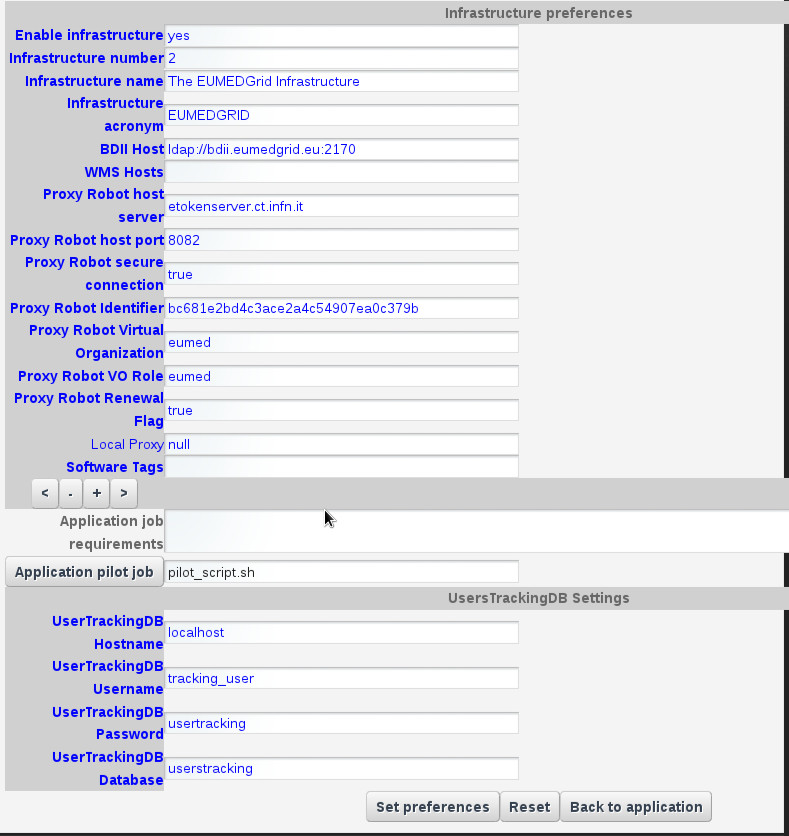
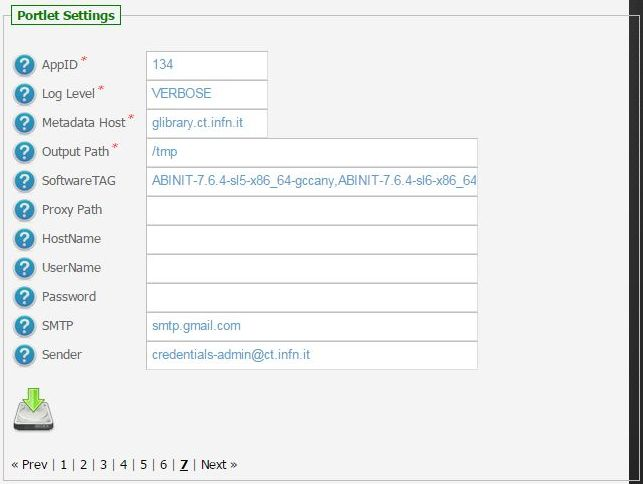
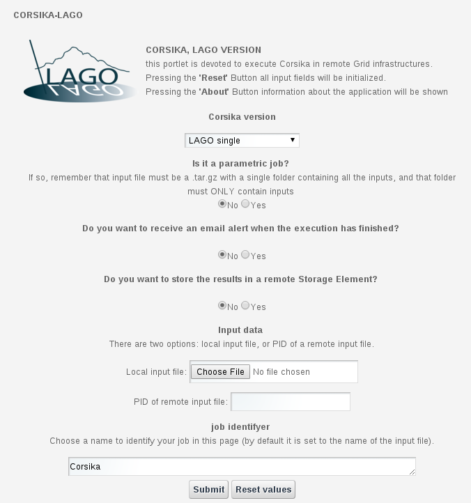
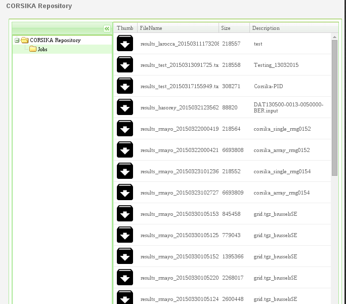

************
CORSIKA-LAGO
************

============
About
============

-------------

LAGO is an international project from more than 80 scientists of 8 latinamerican countries started in 2005 (complete list of the collaboration members and their institutions). The LAGO project aims at observing Gamma Ray Bursts (GRBs) by the single particle technique using water Cherenkov detectors (WCD). It consists of various sites at high altitude, in order to reach a good sensitivity to the faint signal expected from the high energy photons from GRBs.

CORSIKA (COsmic Ray SImulations for KAscade) is a program for detailed simulation of extensive air showers initiated by high energy cosmic ray particles. Protons, light nuclei up to iron, photons, and many other particles may be treated as primaries.

============
Installation
============
To install the CORSIKA-LAGO portlet the WAR file has to be deployed into the application server.

As soon as the portlet has been successfully deployed on the Science Gateway the administrator has to configure:

- the list of e-Infrastructures where the application can be executed;

- some additional application settings.

1.) To configure a generic e-Infrastructure, the following settings have to be provided:

**Enabled**: A true/false flag which enables or disable the generic e-Infrastructure;

**Infrastructure**: The acronym to reference the e-Infrastructure;

**VOName**: The VO for this e-Infrastructure;

**TopBDII**: The Top BDII for this e-Infrastructure;

**WMS Endpoint**: A list of WMS endpoint for this e-Infrastructure (max. 10);

**MyProxyServer**: The MyProxyServer for this e-Infrastructure;

**eTokenServer**: The eTokenServer for this e-Infrastructure;

**Port**: The eTokenServer port for this e-Infrastructure;

**Serial Number**: The MD5SUM of the robot certificate to be used for this e-Infrastructure;

**WebDAV**: The EMI-3 DPM Grid Storage Element, with WebDAV interface, to be used for this e-Infrastructure;

In the following figure is shown how the portlet has been configured to run simulation on the EUMEDGRID-Support e-Infrastructure.

2.) To configure the application, the following settings have to be provided:

**AppID**: The ApplicationID as registered in the UserTracking MySQL database (GridOperations table);

**Log Level**: The log level for the application (e.g.: *INFO* or *VERBOSE*);

**Metadata Host**: The Metadata hostname where download/upload digital-assets (e.g. *glibrary.ct.infn.it*);

**Software TAG**: The list of software tags requested by the application;

**SMTP Host**: The SMTP server used to send notification to users;

**Sender**: The FROM e-mail address to send notification messages about the jobs execution to users;

.. _CHAIN-REDS: https://science-gateway.chain-project.eu/
.. _gLibrary: https://glibrary.ct.infn.it/

In the figure below is shown how the application settings have been configured to run on the CHAIN-REDS_ Science Gateway.

============
Usage
============

To run the Corsika simulation the user has to:

- Select the type of simulation to perform, corresponding to one of the three Corsika versions: single, array or epos-thining-qsj2.

- Choose whether the input file corresponds to a single simulation or to a group of them. In the later, files must be compressed on tar.gz format. 

- Choose whether to receive a confirmation email at the end of the execution-

- Choose what to do with the output files. If a Storage Element is desired, files will be uploaded and remain there for a long time. If not, they will be stored in the Science Gateway, altough their lifetime will probably be shorter. 

- Last but not least, choose an input file or insert a PID where the input file is stored. 

- The system will automatically create a name for the run. If a different one is desired, it can be freely modified. 

Each run will produce:

- std.txt: the standard output file;

- std.err: the standard error file;

- abinit.log: the application log file;

- some additional log files. By default, only the std OUT/ERR files will be provided;

- .tar.gz: the application results available through the gLibrary_ Metadata Server.

A typical simulation produces, at the end, the following files:

.. code:: bash

	]$ tree 26_144903
	26_144903
	|-- corsika-Error.txt
	|-- corsika-Output.txt
	`-- results
	    |-- DAT030014
	    |-- DAT030014-0014-0527176.input
	    `-- DAT030014.dbase

.. _here: https://science-gateway.chain-project.eu/corsika_browse

To inspect Corsika log files:

- *navigate* the digital repository for the application clicking [ here_ ];

- *select* the digital assets of any interest for downloading as shown in the figure below:

============
References
============

.. _1: http://agenda.ct.infn.it/event/1110/

* CHAIN-REDS Conference: *"Open Science at the Global Scale: Sharing e-Infrastructures, Sharing Knowledge, Sharing Progress"* – March 31, 2015 – Brussels, Belgium [1_];

============
Contributors
============
Please feel free to contact us any time if you have any questions or comments.

.. _Sci-Track: http://rdgroups.ciemat.es/web/sci-track/
.. _INFN: http://www.ct.infn.it/

:Authors:
 `Manuel RODRIGUEZ-PASCUAL <mailto:manuel.rodriguez@ciemat.es>`_ - CIEMAT Sci-Track

 `Giuseppe LA ROCCA <mailto:giuseppe.larocca@ct.infn.it>`_ - Italian National Institute of Nuclear Physics (INFN_)

